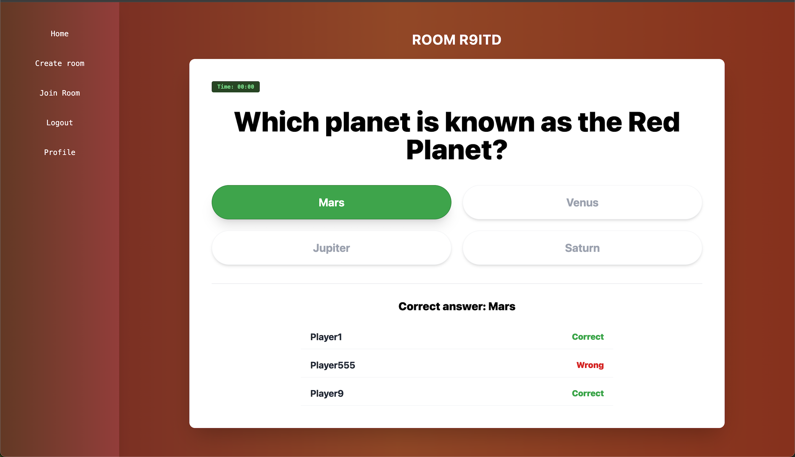
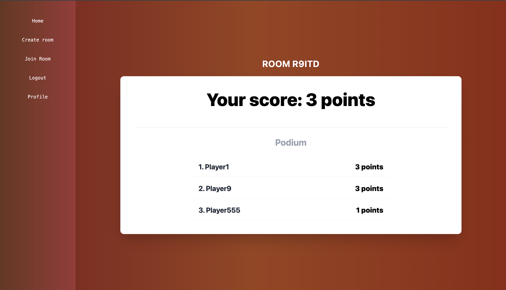

# Realtime Quiz App

A simple real-time quiz application. The project includes a Django/Channels backend, a React frontend, and PostgreSQL and Redis services managed with Docker Compose.

## Main Features

- create and join quiz rooms,
- real-time gameplay over WebSocket with Redis,
- user authentication,
- quiz history and score ranking,
- lobby view with room participants.

## Tech Stack

- Backend: Django, Django REST Framework, Channels
- Frontend: React, Vite
- Database: PostgreSQL
- Realtime/cache: Redis
- Environment: Docker Compose

## Game Screenshots

<p>
  
  
  
</p>

## Getting Started

```bash
docker compose up --build
```

After startup, the application is available at:

- Frontend: `http://localhost:5173`
- Backend API: `http://localhost:8000`

Stop the containers:

```bash
docker compose down
```

## Tests

```bash
docker compose -f docker-compose.test.yml up --build
```
