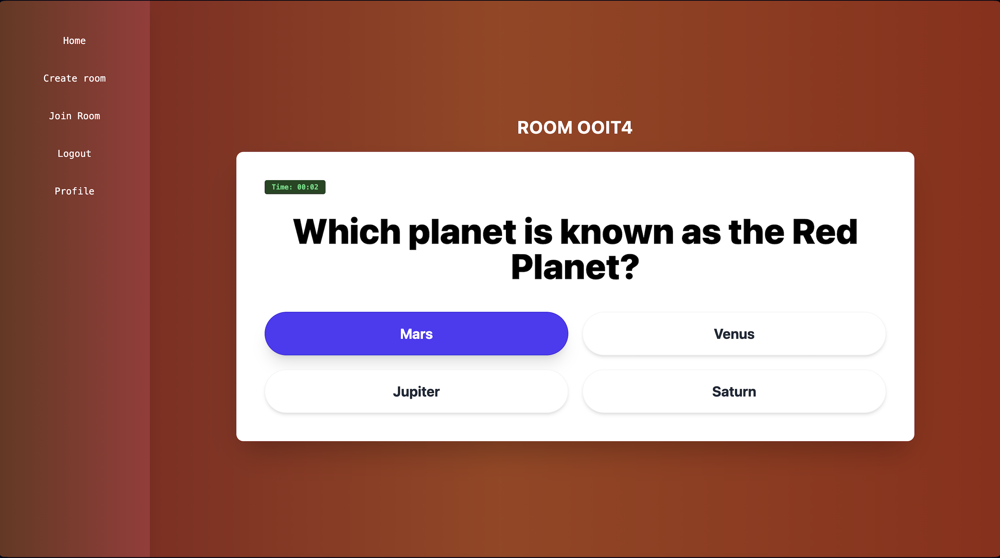
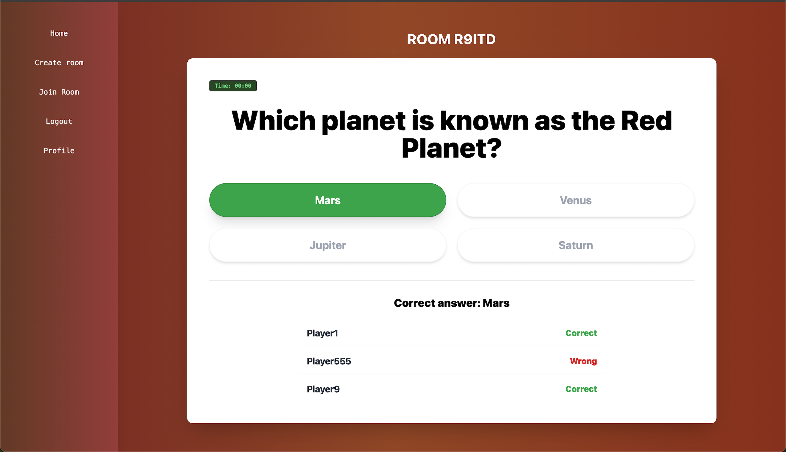
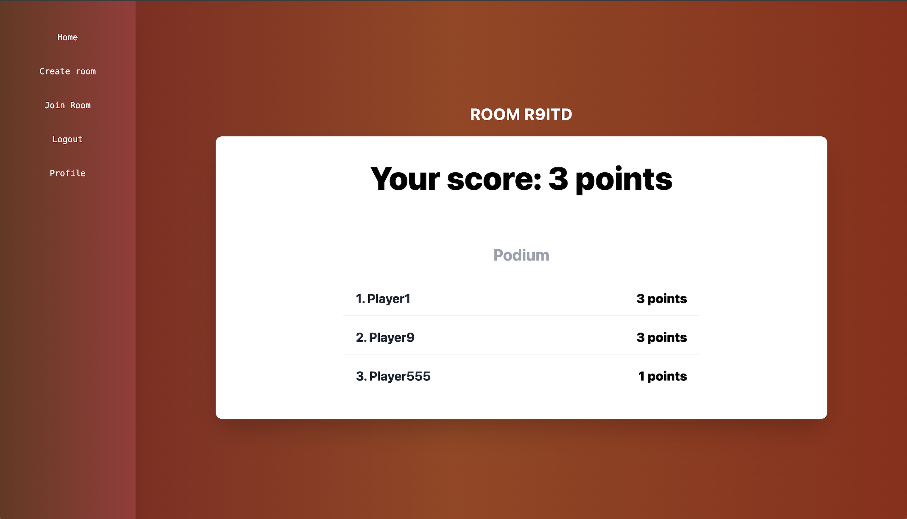

# Realtime Quiz App

A simple real-time quiz application. The project includes a Django/Channels backend, a React frontend, and PostgreSQL and Redis services managed with Docker Compose.

## Main Features

- create and join quiz rooms,
- real-time gameplay over WebSocket with Redis,
- user authentication,
- quiz history and score ranking,
- lobby view with room participants.

## Tech Stack

- Backend: Django, Django REST Framework, Channels
- Frontend: React, Vite
- Database: PostgreSQL
- Realtime/cache: Redis
- Environment: Docker Compose

## Backend Structure

The Django backend is split into small domain applications directly under
`backend`, next to the `config` package:

- `users` — registration, JWT endpoints, and WebSocket authentication,
- `quizzes`, `questions`, `choices`, `histories` — one Django app per model,
- `rooms` — lobby API, Redis service, and room consumer,
- `games` — gameplay service and game consumer,
- `common` — shared infrastructure such as Redis clients.

Project-wide settings, URL configuration, and ASGI/WSGI entry points live in
`backend/config`.

## Game Screenshots

<p>
  
  
  
  
</p>

## Getting Started

```bash
docker compose up --build
```

After startup, the application is available at:

- Frontend: `http://localhost:5173`
- Backend API: `http://localhost:8000`

## Adding a Quiz

After a fresh clone, the database is empty. To add the sample quiz, run:

```bash
docker compose exec web python manage.py seed_quiz
```

You can also create quizzes through the backend API:

```text
POST http://localhost:8000/api/create_quiz/
```

Stop the containers:

```bash
docker compose down
```

## Tests

```bash
docker compose run --rm --build test
```
